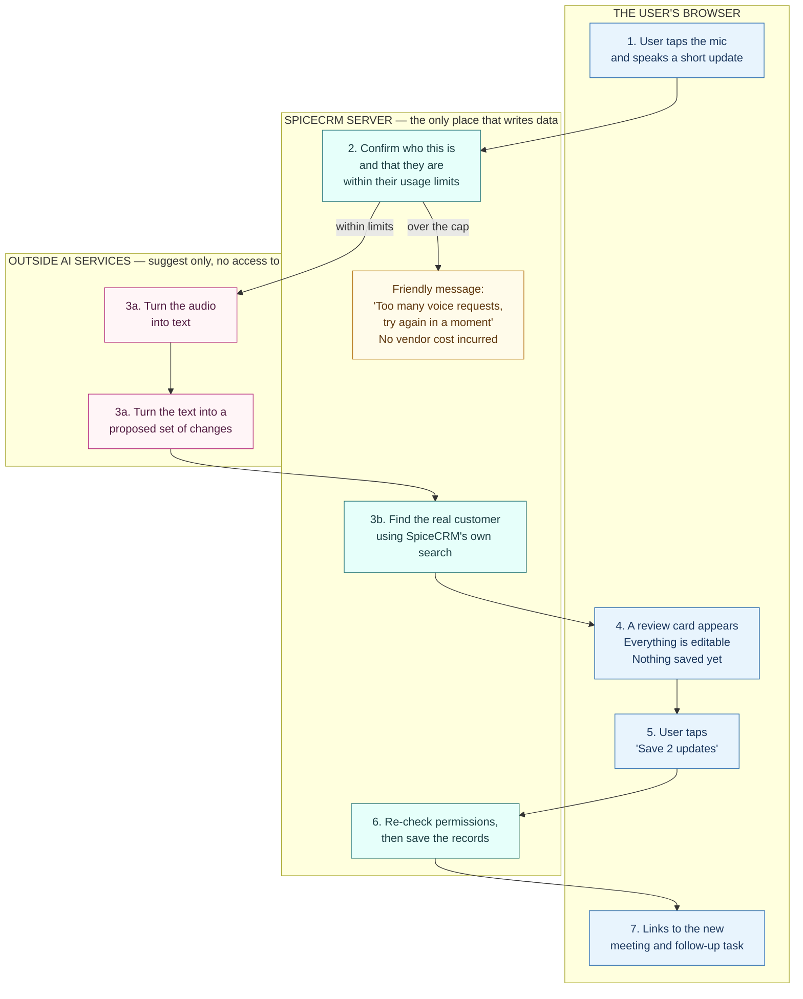
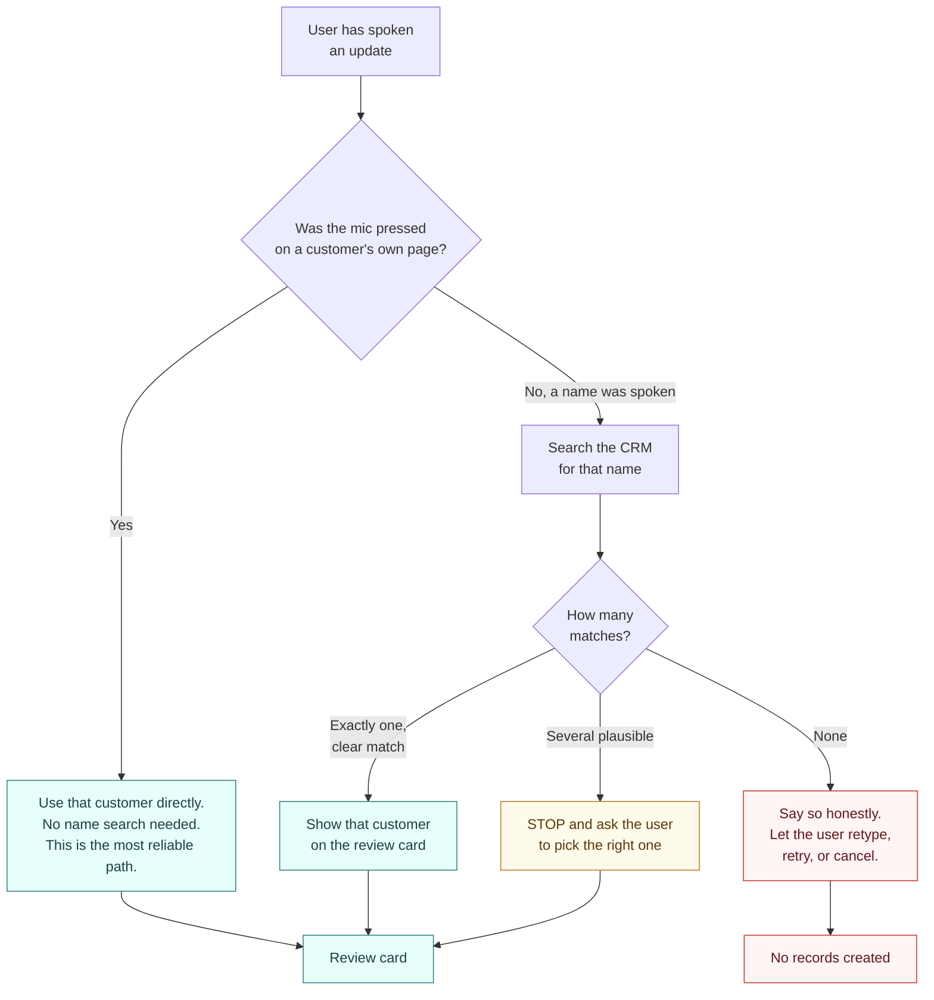
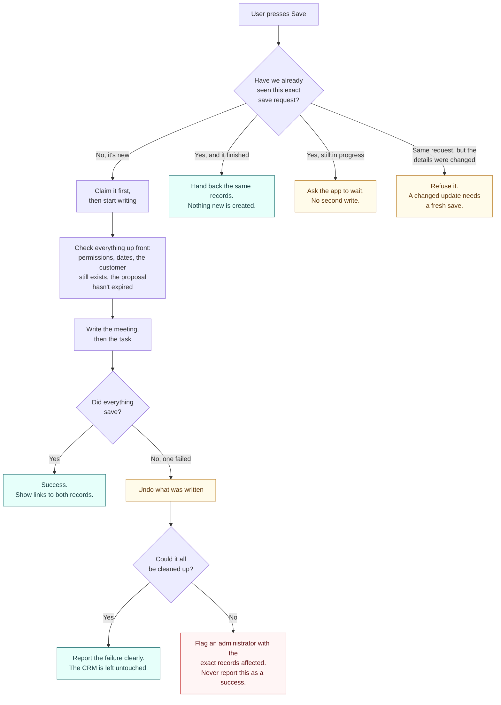
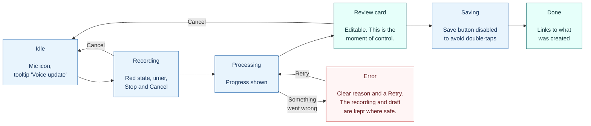
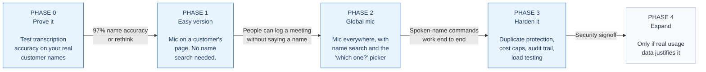
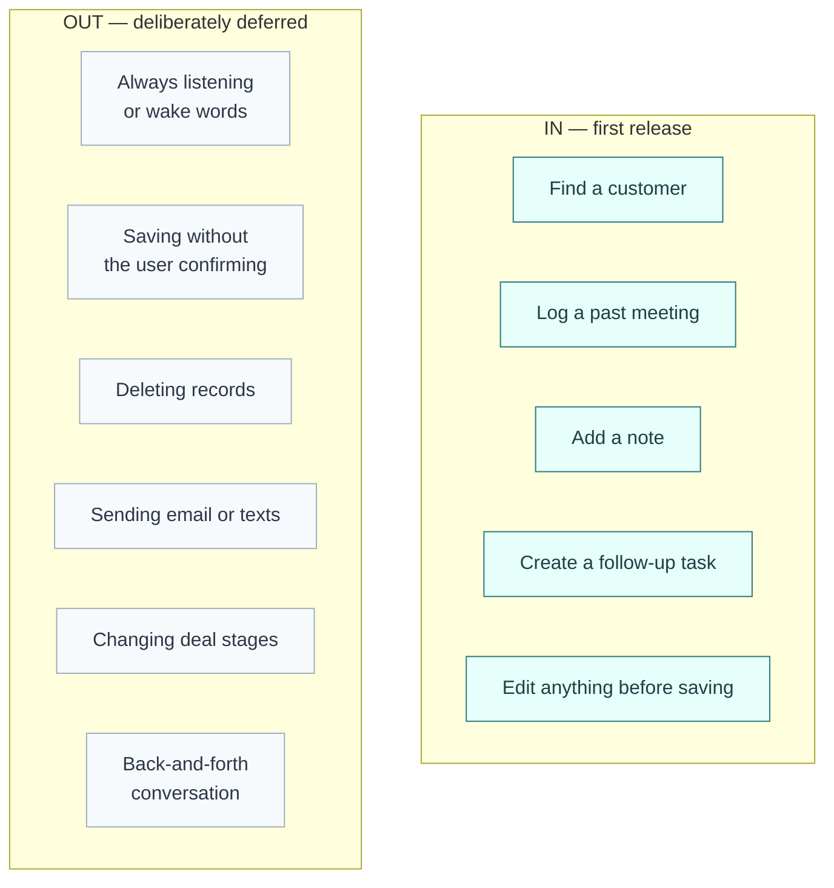

# SpiceCRM Voice Assistant — How It Works

A plain-language visual companion to the Voice Assistant Technical Design v1.1.
Open this file in preview to see the diagrams rendered.

---

## 1. The journey, start to finish

A user speaks. The system proposes. The user approves. Only then is anything saved.

Notice the three boxes: the browser is where people work, the SpiceCRM server is the
**only** place data gets written, and the outside AI services can read and suggest but
never touch the database.

**The key idea in one line:** the AI is allowed to suggest, only SpiceCRM is allowed to save.

---

## 2. Finding the right customer — the system never guesses

This is the highest-risk moment in the whole feature. Attaching a meeting to the wrong
customer is worse than failing outright, because nobody notices for weeks.

Two things worth noting. First, the mic placed on a customer's page skips the risky step
entirely, which is why it's recommended to ship first. Second, "several plausible matches"
always becomes a question to the user, never a coin flip.

---

## 3. Saving safely — no duplicates, no half-finished work

If someone's network hiccups when they press Save, the app may send the request twice.
Without protection that means two identical meetings in the CRM. Here's how that's prevented.

The promise being made here is specific: zero duplicate records from retries, and never a
success message covering up a partial write.

---

## 4. What the user sees at each moment

Cancel is always available before Save, and cancelling writes nothing at all.

---

## 5. How this gets delivered

Phase 0 is cheap and answers the one question that could sink the project: does speech-to-text
reliably get your customers' names right? If it doesn't, you find out in days rather than months.

---

## 6. What's explicitly *not* being built

Each exclusion is a choice, not an oversight. The first release earns trust on a narrow set
of low-risk actions before taking on anything that changes forecasts or contacts customers.

---

## 7. Decisions needed from the business

| Question | Why it blocks work |
|---|---|
| How long may we keep the audio and transcripts? | Policy call, not an engineering one. Shapes the storage design. |
| Ship the customer-page mic first, or both entry points together? | Changes the first release scope and timeline. |
| When someone says "week of the 25th" and one date is required, what should it be? | Either ask the user every time or pick a default such as Monday morning. |
| What usage data may we keep in production? | Determines whether we can measure if the feature actually works. |

Four more technical questions need whoever administers the deployed SpiceCRM instance,
mainly which exact version is installed and how meetings should link to different record types.
